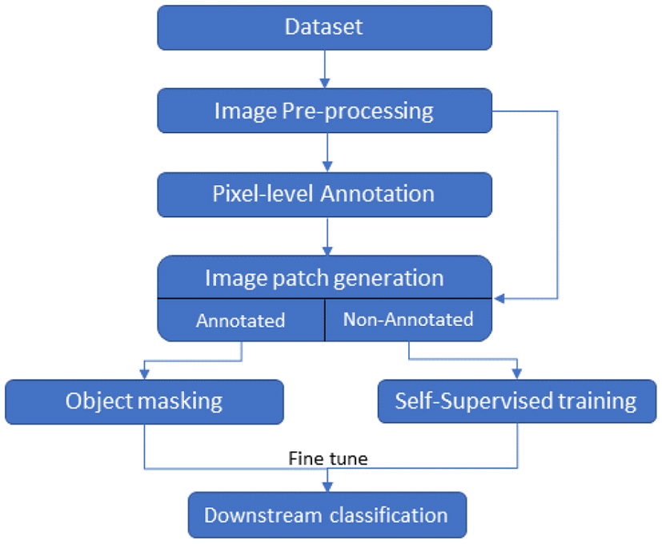
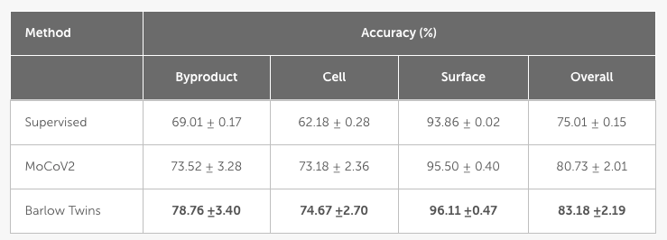
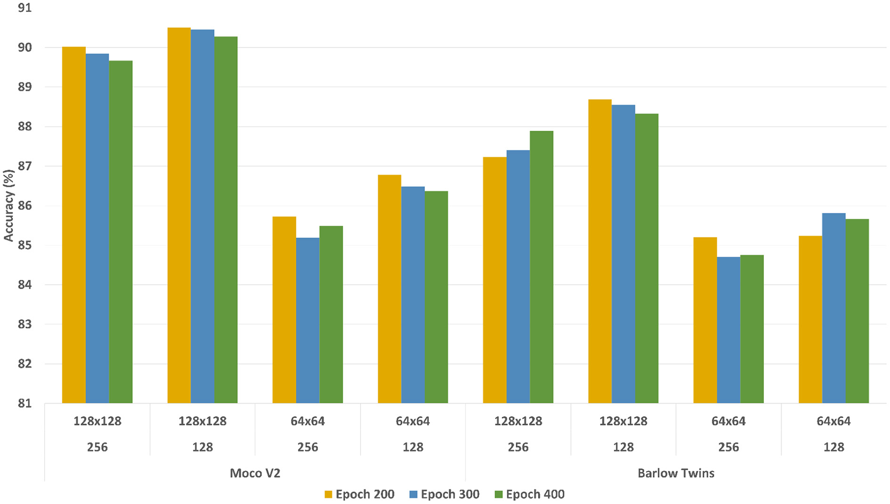
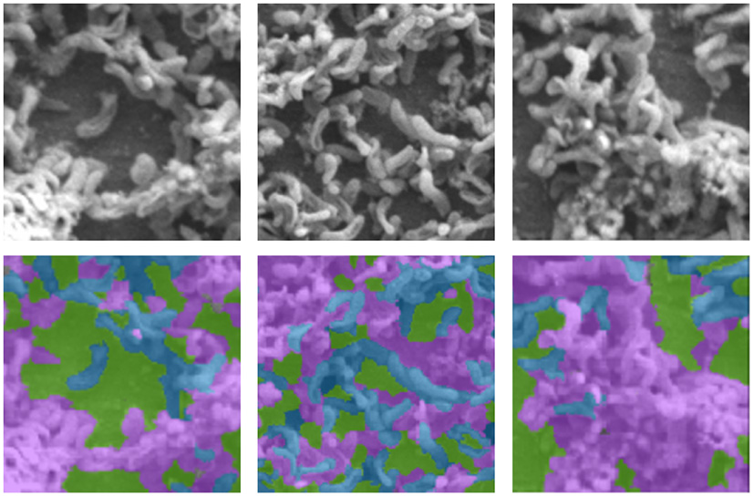

# Self-supervised learning of Biofilm images using MoCo

## 🔹 Project Overview  
This project presents an AI-driven approach for detecting microbial cells, MIC byproducts, and surface regions from low-volume Scanning Electron Microscope (SEM) images of biofilms.

The goal is to automate biofilm image analysis while minimizing expert annotation effort using self-supervised learning (SSL) techniques.

---

## 🔬 Key Contributions
- Developed self-supervised pipelines (MoCoV2, Barlow Twins) for SEM image understanding  
- Achieved ~6–8% improvement over supervised baselines  
- Reduced annotation requirement to ~10% of data  
- Enabled multi-class classification:
  - Microbial Cells  
  - MIC Byproducts  
  - Non-occluded Surface  

---

## 🧠 Methodology

### Pipeline Overview


- Image preprocessing and patch generation  
- Partial annotation (~10%)  
- Self-supervised representation learning  
- Fine-tuning with labeled data  
- Patch-level classification  

---

## 🧪 Model Architectures
- MoCoV2 (Contrastive learning)  
- Barlow Twins (Non-contrastive learning)  
- Backbone: ResNet50  

---

## 📊 Results

### Quantitative Performance


- Barlow Twins achieved best overall accuracy (~83%)  
- Significant improvement over supervised baseline (~75%)  

### Training Analysis


- Evaluated across:
  - Patch sizes: 64×64, 128×128  
  - Batch sizes: 128, 256  
  - Epochs: 200, 300, 400  

---


## SEM Images Annotation


- Top: Original SEM images  
- Bottom: Annotated images 
  - 🟣 Byproducts  
  - 🔵 Cells  
  - 🟢 Surface  

---

## ⚙️ Implementation (MoCoV2)

This project uses the Facebook Research MoCo implementation.

### 🔹 Pretraining (MoCo)
```bash
python3 main_moco.py \
  -a resnet50 \
  --lr 0.03 \
  --batch-size 256 \
  --dist-url 'tcp://localhost:10001' \
  --multiprocessing-distributed \
  --mlp \
  --moco-t 0.2 \
  --aug-plus \
  --cos \
  --world-size 1 \
  --rank 0 \
  [dataset-path]
```
### 🔹 Linear Evaluation
```bash
python3 main_lincls.py \
  [data-path] \
  --lr 0.3 \
  --pretrained [model-path]

---

## 📄 Paper

🔗 **Full Paper:** https://www.frontiersin.org/journals/microbiology/articles/10.3389/fmicb.2022.996400/full

---

## 📌 Citation

### 🔹 IEEE Format
```bibtex
@article{abeyrathna2022ai,
  title={An AI-based approach for detecting cells and microbial byproducts in low volume scanning electron microscope images of biofilms},
  author={Abeyrathna, Dilanga and Ashaduzzaman, Md and Malshe, Milind and Kalimuthu, Jawaharraj and Gadhamshetty, Venkataramana and Chundi, Parvathi and Subramaniam, Mahadevan},
  journal={Frontiers in Microbiology},
  volume={13},
  pages={996400},
  year={2022},
  publisher={Frontiers Media SA}
}
